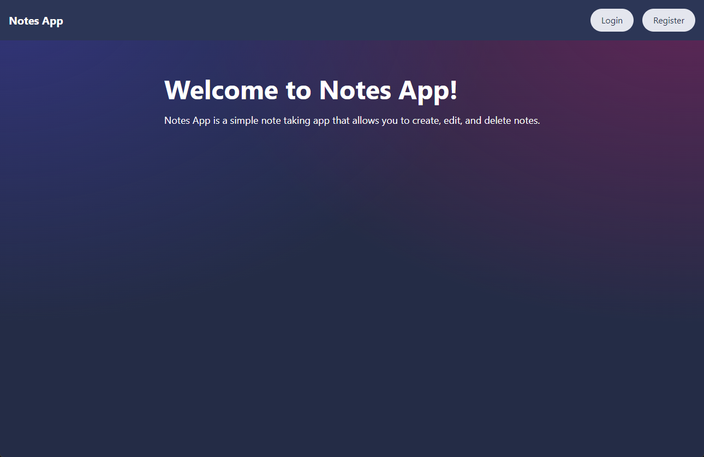
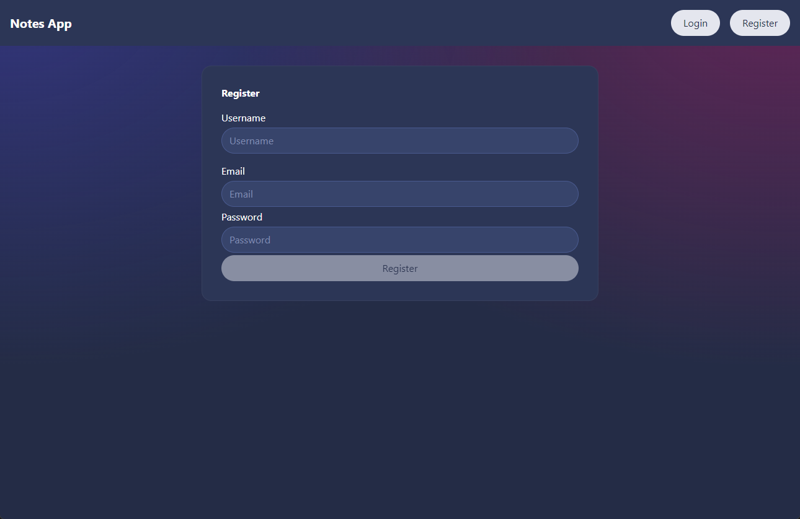
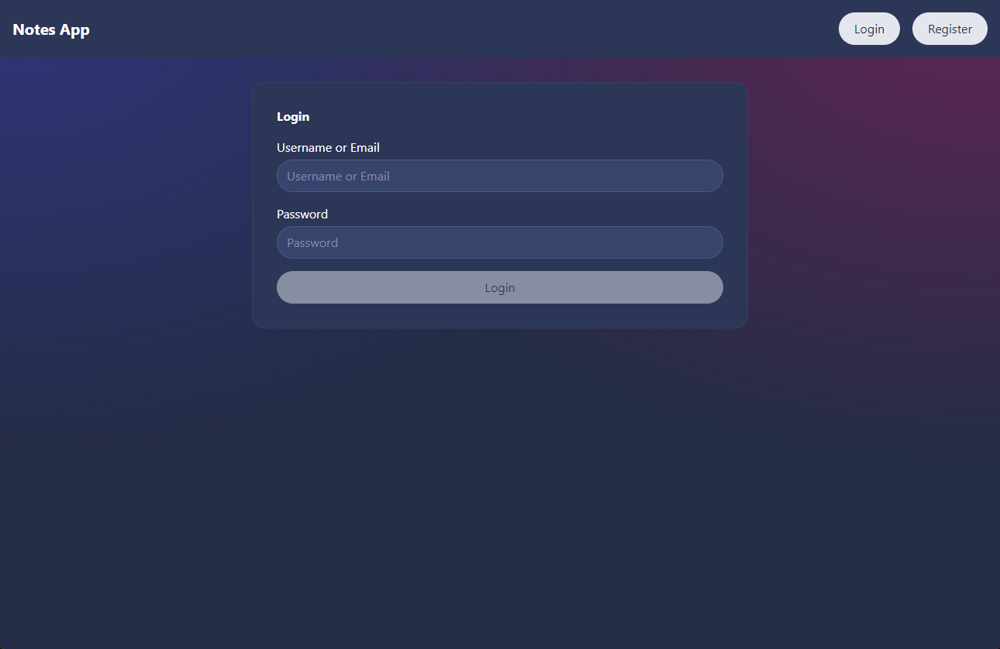
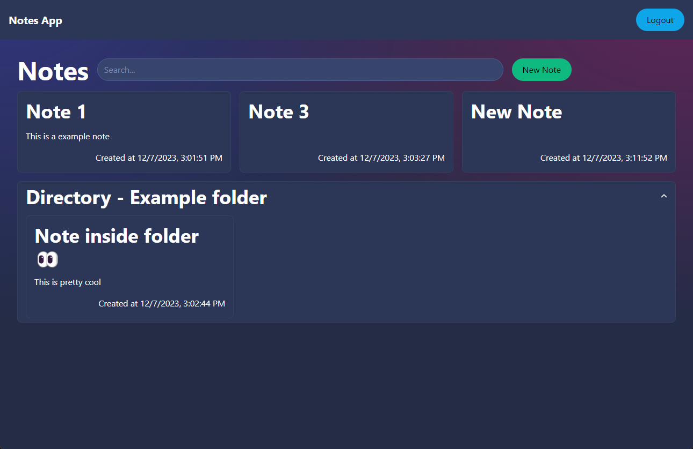
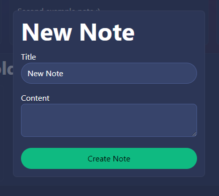
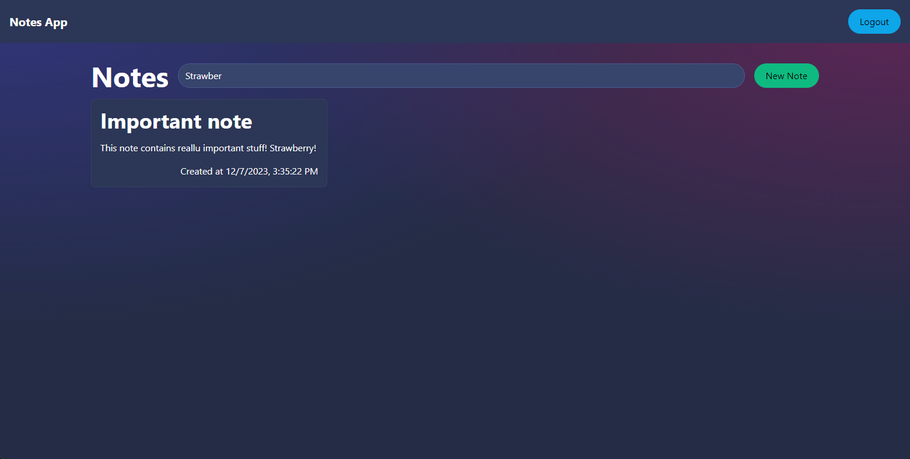
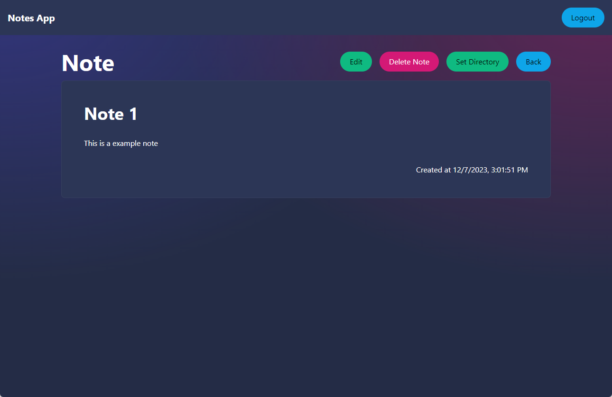
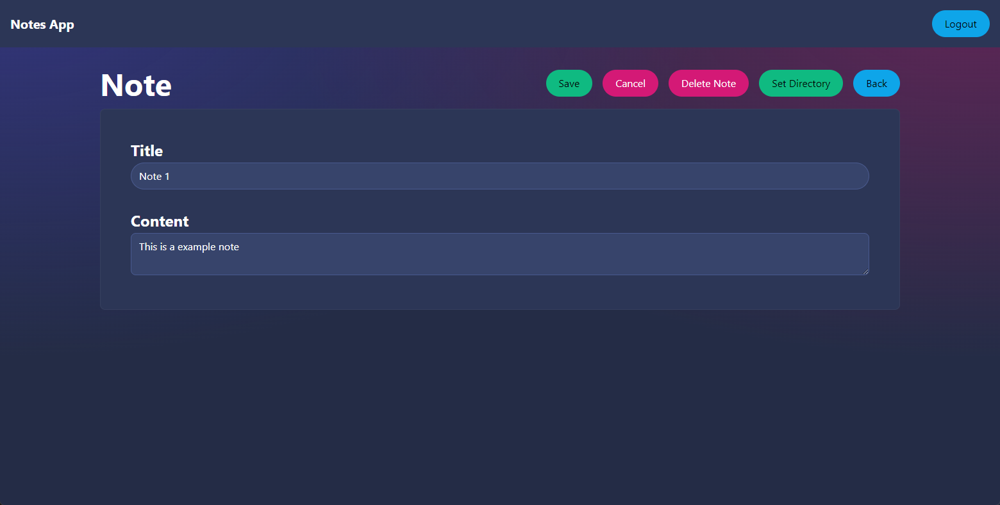

# User Guide

This guide is intended for end users to introduce them to the website and help them get started.

## Table of contents

1. [Register an account](#step-1-register-an-account)
2. [Login to your account](#step-2-login-to-your-account)
3. [Create a note](#step-3-create-a-note)
4. [Search for a note](#step-4-search-for-a-note)
5. [View a note](#step-5-view-a-note)
6. [Edit a note](#step-6-edit-a-note)
7. [Delete a note](#step-7-delete-a-note)
8. [Change a note's directory](#step-8-change-a-notes-directory)
9. [Logout](#step-9-logout)

## Step 1: Register an account

To register an account, go to the landing page ([https://optocloud.no/](https://optocloud.no/))

Click on the "Register" button in the top right corner, and you will be redirected to the registration page.

Fill in the form and click on the "Register" button, if the registration is successful you will be redirected to the login page, if not you will be shown an error message.

## Step 2: Login to your account

To login to your account, go to the landing page ([https://optocloud.no/](https://optocloud.no/))

Click on the "Login" button in the top right corner, and you will be redirected to the login page.

Fill in the form and click on the "Login" button, if the login is successful you will be redirected to the home page, if not you will be shown an error message.

## Step 3: Create a note

To create a note, log in to your account and you will be redirected to the home page.

Click on the "Create note" button in the top right corner, and you will get a popup where you can fill in the note's title and content.

Fill in the title and content you want, and click on the "Create" button, if the note is created successfully you will get a success message and it will be added to the list of notes, if not you will be shown an error message.

## Step 4: Search for a note

To search for a note, log in to your account and you will be redirected to the home page.

Type in the search bar at the top of the page, and the notes will be filtered by title and content.

## Step 5: View a note

To view a note, log in to your account and you will be redirected to the home page.

Notes are listed on the home page, grouped by directory.

Notes without a parent directory are at the top of the list, and notes with a parent directory are listed under their parent directory.

To view, edit, delete, or change a note's directory, click on the note and you will be redirected to the note page.

## Step 6: Edit a note

To edit a note, log in to your account, navigate to the note you want to edit, and click on it.

Click on the "Edit" button in the top right corner, and the note title and content will become editable.

To save any changes you make, click on the "Save" button, if the note is saved successfully you will get a success message and the note will be updated, if not you will be shown an error message.

If you want to discard any changes you made, click on the "Cancel" button.

## Step 7: Delete a note

To delete a note, log in to your account, navigate to the note you want to delete, and click on it.

Click on the "Delete" button in the top right corner, and it will be deleted.

## Step 8: Change a note's directory

To change a note's directory, log in to your account, navigate to the note you want to change the directory of, and click on it.

Click on the "Set Directory" button in the top right corner, and you will get a popup where you can type in the name of the directory you want to move the note to.

After this you can confirm your changes and the note will be moved to the directory you specified.

## Step 9: Logout

To logout, log in to your account and you will be redirected to the home page.

Click on the "Logout" button in the top right corner, and you will be logged out and redirected to the login page.
